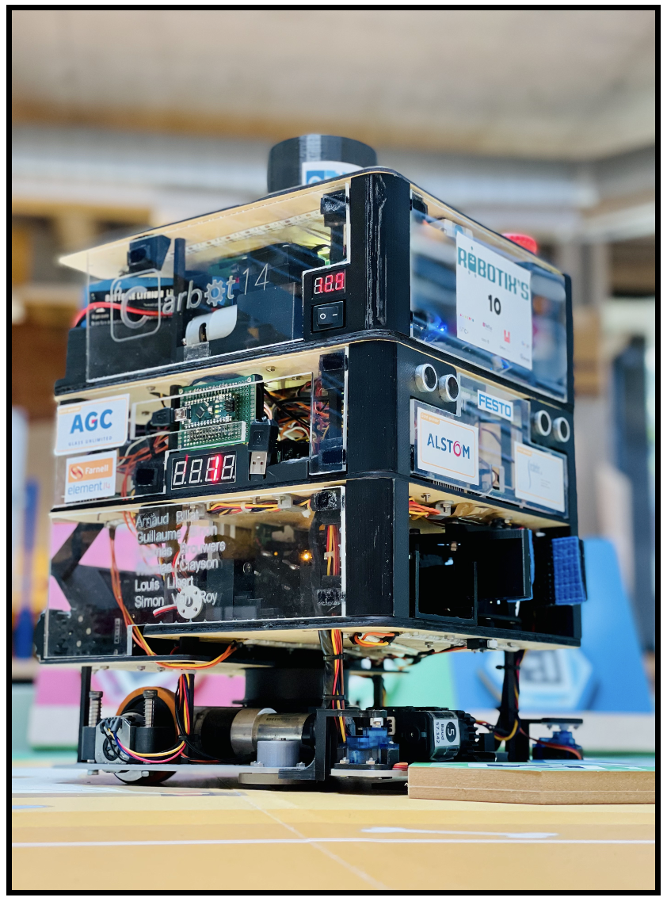

----------------------------
Welcome to the Carbot14's github
----------------------------

----------------------------
Firstly, If you want to get straight into the code we invite you to go into the CTRL folder and read the Readme in it instead
-----------------------------
	cd CTRL/
-----------------------------

To introduce ourselves, we are Group 5 of the LELME2002 project running in 2021-2022. You can see our finished baby

	

The code found here is not the better in any way. Get inspired but stay critical and do not copy our mistakes (:

All the code found here is in C++. It is the final version in it will not be updated from now (June 2022)
We invite you to check the video's in [Youtube video's](www.google.com)

-----------------------------
What is in ./CTRL
-----------------------------

	cd CTRL/build
You will find in the build file, the makefile as well as some extracted data from our tests

	cd CTRL/sources
You will find in it all the subfolders needed for the robot. don't hesitate to inspire yourself without forgetting to mention your source (:

	cd CTRL/teensy
You will find in it the folders used in our teensy & in our arduino to control respectively the 
	- dynamixels, the steppers, servos 
	- 7 segments display 

-----------------------------
If you have any questions :
	simon.vanroy@student.uclouvain.be
-----------------------------
